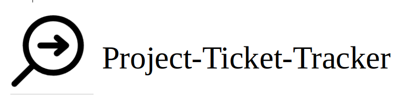

# Project-Ticket-Tracker - <a href="https://project-ticket-tracker.web.app/">Live-Link</a>

### Full stack application for tracking projects, tickets, bugs, issues and features.

#### This projects helps your employees to track everything when a new project starts. It has inbuilt functionality that helps users to assign tasks and collaborate with fellow employees. 

<hr>

## Features 
1. User Authentication 
2. Add Projects and assign a team
3. Add Comments to projects 
4. Add Tickets and assign developers
5. Edit Tickets, collaborate, complete and delete tickets
6. See logged in users
7. Update user profile 

<hr>

## Tech Stack:
* ReactJS
* Firebase
* Chakra UI

<hr>

## Project Demo
https://user-images.githubusercontent.com/64259603/154788274-7b75f6d2-3762-4823-b494-6d27a1f2a2bf.mp4
<hr>

## Setup
### To get a local copy of Project-Ticket-Tracker and running, follow these steps:


Clone the repo

``` 
git clone <https://github.com/MajorChe/Project-Ticket-Tracker.git> <pathname> 
```

#### Firebase setup for project - <a href="https://firebase.google.com/docs/web/setup">Instructions</a>

## Install all npm dependencies 
Please go inside client and server folders and do:

```
npm install
```

Run React front end Locally!

``` 
npm start 
```


## Feel free to Chat 
* charit.sharma@outlook.com


